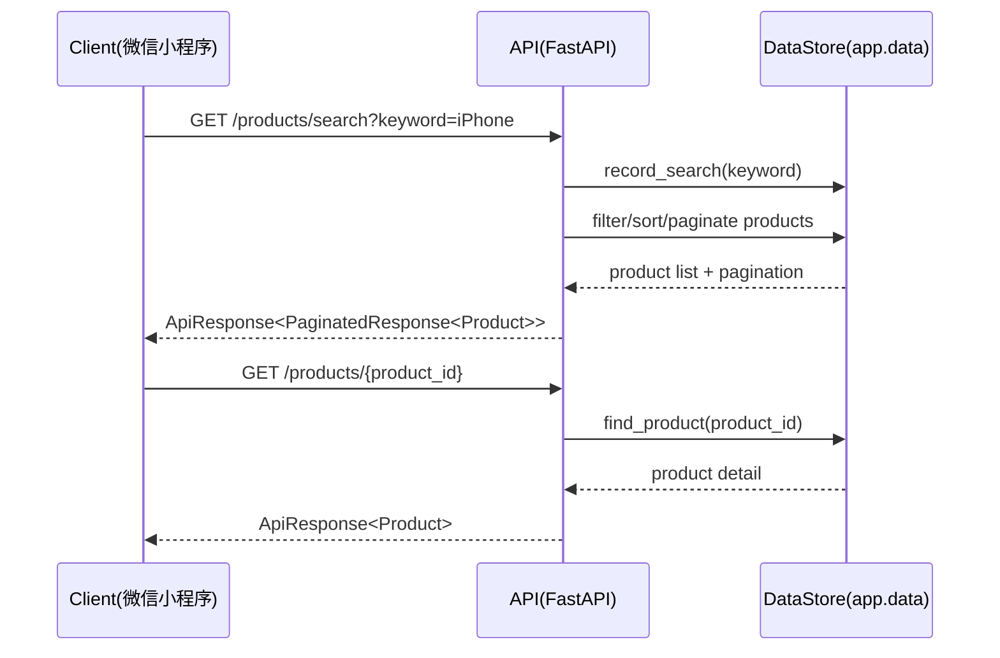
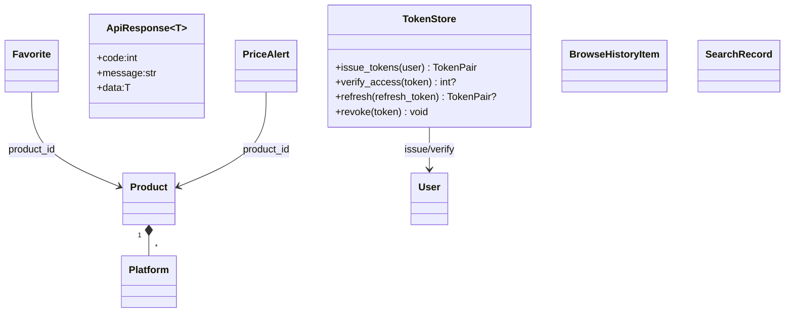

# 《一次买够》网购比价平台

> 依据《项目需求规格说明书》和 `openapi.json` 提供的接口契约，完成的后端示例实现（FastAPI）与文档补充。

## 背景与核心需求

来自需求文档的关键要点：

- **核心价值**：一次搜索聚合淘宝、京东、拼多多等平台价格与促销，降低比价成本，并提供历史趋势与跳转购买入口。
- **用户故事覆盖**：  
  - 比价者：同屏比价多平台同款商品。  
  - 精打细算者：按价格、销量、平台、信誉排序筛选。  
  - 观望者：收藏并设置降价提醒。  
  - 决策者：查看 90 天价格趋势，判断是否入手。  
  - 行动者：一键跳转原平台完成购买。
- **主要功能**：商品聚合搜索/筛选、商品详情与跳转、微信登录、收藏与降价提醒、浏览历史与搜索记录、个性化推荐与埋点上报。
- **非功能性提示**：模块化解耦、基础安全防护、请求性能目标（常规搜索 < 2s，百级并发）、容器化与 CI/CD（文档推荐 Django/MySQL/Redis，可按场景替换）。

## 当前后端实现概述

本仓库包含一个 **FastAPI** 演示服务，使用内存数据模拟商品、收藏、降价提醒等场景，并完整覆盖 `openapi.json` 中定义的 16 个接口（含鉴权流程）。适合前端/联调/演示使用。

- 语言/框架：Python 3.12 + FastAPI + Uvicorn
- 认证方式：Bearer Token（登录返回 access_token / refresh_token）
- 数据存储：内存模拟数据（无外部依赖，重启即重置）
- API 契约：与根目录 `openapi.json` 保持一致

## 快速开始

```bash
# 1) 安装依赖
pip install -r requirements.txt

# 2) 启动服务 (默认 http://127.0.0.1:8000)
uvicorn app.main:app --reload

# 3) 打开交互文档
# http://127.0.0.1:8000/docs 或 /redoc
```

> 如果需要自测，可运行：`python -m pytest`

## 主要接口速览

所有接口的入参/出参请以 `openapi.json` 为准，以下为常用示例：

### 认证
- `POST /auth/login`：传入 `{code, raw_data, signature}` 获取 `access_token`、`refresh_token`。  
- `POST /auth/refresh`：使用 `refresh_token` 换新。  
- `POST /auth/logout`：可选携带 `Authorization: Bearer <token>` 让服务端清理。

> 需鉴权的接口请在 Header 添加：`Authorization: Bearer <access_token>`

### 商品与搜索
- `GET /products/search`：关键词搜索，支持价格区间、类目、平台过滤及排序（price_asc/price_desc/sales_desc/rating_desc），返回分页列表。  
- `GET /products/{product_id}`：获取商品详情（含多平台价格）。  
- `GET /products/categories`：按 `parent_id` 获取分类树。

### 用户与收藏
- `GET/PUT /users/profile`：查询/更新用户基础信息。  
- `GET/POST /users/favorites`：分页查看与新增收藏；`PUT/DELETE /users/favorites/{favorite_id}` 更新备注或删除。

### 降价提醒
- `GET/POST /users/price-alerts`：分页查询或创建提醒（可选监控平台）。  
- `PUT/DELETE /users/price-alerts/{alert_id}`：更新目标价/启用状态或删除。

### 浏览历史 & 搜索
- `GET/POST/DELETE /users/browse-history`：分页获取、追加或清空浏览记录。  
- `GET /users/search-records`：分页返回搜索历史。  
- `GET /search/hot-words`：返回热搜词榜（公开接口）。

### 推荐与埋点
- `GET /recommendations/personalized`：基于行为的个性化推荐（示例数据）。  
- `POST /analytics/events`：上报用户事件（search、product_click、add_favorite 等）。

## 设计与实现说明

- **统一响应格式**：`ApiResponse` `{code, message, data}`，成功 `code=0`，错误返回非 0 业务码与 HTTP 状态码。  
- **分页**：采用 `page/page_size`，返回 `list + pagination{page,page_size,total,total_pages,has_next,has_prev}`。  
- **鉴权**：除登录/刷新/热搜等公开接口外，其余均需 Bearer Token。示例 Token 为内存颁发，适合联调与演示。  
- **示例数据**：商品/平台报价、收藏、降价提醒、历史记录、热搜词均为内存示例，重启后重置，可按需扩展或替换为数据库/爬虫数据源。

## 开发与扩展建议

- 若接入真实数据，可按需求文档推荐的分层方式将数据层替换为数据库（MySQL/Redis）及爬虫采集模块。  
- 安全与风控：生产环境需替换为真实 JWT、鉴权中间件，并完善速率限制、输入校验与监控告警。  
- 部署：可使用 `uvicorn` + `gunicorn` 或容器化部署，前置 Nginx/负载均衡，与 CI/CD 流程集成。  

## 参考资料

- 需求文档：`项目需求规格说明书.docx`  
- 接口契约：`openapi.json`（OpenAPI 3.0）

## 后端系统设计补充（对应“系统设计说明.png”）

> 以下内容在现有《系统设计说明书》基础上，补充后端实现所需的设计说明，覆盖图中 1~8 项要求。

### 1. 系统体系架构（后端视角）

- **接入层**：Nginx/API 网关（生产）或 Uvicorn（演示）接收 HTTPS 请求，转发至 FastAPI 服务。  
- **应用层**：`app/main.py` 提供 RESTful API，按认证、商品、用户、收藏、降价提醒、推荐、分析等业务分组。  
- **领域与数据层**：`app/schemas.py` 定义统一数据模型；`app/data.py` 提供示例数据与查询能力；`app/auth.py` 负责令牌签发、校验、刷新。  
- **横切能力**：统一响应（`ApiResponse`）、统一异常处理、鉴权依赖注入（`Depends(get_current_user)`）。

### 2. 系统功能结构（层次结构）

- **认证与安全模块**：`/auth/login`、`/auth/refresh`、`/auth/logout`。  
- **商品与搜索模块**：`/products/search`、`/products/{product_id}`、`/products/categories`。  
- **用户中心模块**：`/users/profile`、`/users/favorites*`、`/users/price-alerts*`。  
- **行为与推荐模块**：`/users/browse-history*`、`/users/search-records`、`/search/hot-words`、`/recommendations/personalized`、`/analytics/events`。  
- **基础支撑模块**：分页器 `paginate`、全局异常映射、统一 JSON 结构。

### 3. 系统用例时序图（顺序图）及说明

以“用户搜索商品并查看详情”为例（后端关键链路）：



说明：  
1) 搜索请求进入后，先记录搜索词，再执行关键词过滤、条件筛选、排序与分页。  
2) 商品详情请求按 `product_id` 精确查询；若不存在返回业务错误码 `404001`。  
3) 两类接口均通过统一响应格式返回，便于前端统一解析。

### 4. 复杂功能算法设计（流程/伪码）

#### 4.1 多条件商品搜索与排序算法

```text
Input: keyword, category_id, min_price, max_price, platform, sort, page, page_size
Step1: results <- products 中 title 包含 keyword 的集合
Step2: 若有 category_id, 保留 category_id 匹配项
Step3: 若有价格区间, 保留 min_price/max_price 落在范围内的项
Step4: 若有 platform 过滤, 保留包含任一平台编码的商品
Step5: 按 sort 执行排序(price_asc/price_desc/sales_desc/rating_desc)
Step6: 根据 page/page_size 计算切片并生成 pagination
Output: PaginatedResponse(list, pagination)
```

#### 4.2 降价提醒触发判定算法（后台任务设计）

```text
for alert in price_alerts where is_enabled = true:
    product = find_product(alert.product_id)
    if not product: continue
    current_price = min(平台价) 或 product.min_price
    if current_price <= alert.target_price and alert.is_triggered == false:
        alert.is_triggered = true
        alert.triggered_at = now
        发送通知(站内信/订阅消息)
    alert.current_price = current_price
    alert.updated_at = now
```

### 5. 面向对象方法类图的详细设计



设计说明：  
- `schemas.py` 中模型承担 DTO/领域实体双重角色，保证接口契约稳定。  
- `TokenStore` 为认证核心对象，负责令牌生命周期管理。  
- `data.py` 提供“仓储式”数据访问函数（如 `find_product`、`record_search`）。

### 6. 接口设计（后端）

#### 6.1 统一约定
- 协议：HTTP/HTTPS + JSON。  
- 鉴权：Bearer Token（除登录、刷新、热搜等公开接口）。  
- 成功响应：`{code: 0, message: "ok|业务提示", data: ...}`。  
- 失败响应：HTTP 状态码 + `{code: 业务错误码, message: 错误说明, data: null}`。

#### 6.2 代表性接口

| 模块 | 接口 | 方法 | 说明 |
|---|---|---|---|
| 认证 | `/auth/login` | POST | 微信 code 登录并返回 `TokenPair` |
| 商品 | `/products/search` | GET | 多条件搜索 + 排序 + 分页 |
| 商品 | `/products/{product_id}` | GET | 查询单商品详情 |
| 收藏 | `/users/favorites` | GET/POST | 收藏列表与新增 |
| 降价提醒 | `/users/price-alerts` | GET/POST | 提醒查询与创建 |
| 推荐 | `/recommendations/personalized` | GET | 个性化推荐（示例） |
| 分析 | `/analytics/events` | POST | 用户行为上报 |

> 完整字段结构以 `openapi.json` 与 `app/schemas.py` 为准。

### 7. 数据库物理设计（若涉及）

当前仓库为演示实现，使用内存数据结构（重启后重置）。若落地生产，建议 MySQL + Redis 物理设计如下：

- **MySQL 核心表**：`users`、`products`、`platform_prices`、`favorites`、`price_alerts`、`browse_history`、`search_records`、`analytics_events`。  
- **关键索引**：  
  - `products(title, category_id)`（搜索）  
  - `platform_prices(product_id, platform_code, updated_at)`（比价与最新价）  
  - `favorites(user_id, product_id)`（防重复收藏）  
  - `price_alerts(user_id, is_enabled, is_triggered)`（提醒任务扫描）  
- **Redis 使用建议**：热搜词缓存、Token 黑名单、短期会话态、限流计数器。

### 8. UI（界面）设计（后端配合说明）

后端不直接渲染页面，但为前端界面提供稳定数据契约：

- **首页搜索页**：依赖 `/products/search`、`/search/hot-words`。  
- **商品详情页**：依赖 `/products/{product_id}`，展示多平台价格与跳转链接。  
- **我的收藏/降价提醒页**：依赖 `/users/favorites*`、`/users/price-alerts*`。  
- **个人中心页**：依赖 `/users/profile`。  
- **行为埋点**：页面交互通过 `/analytics/events` 回传，支撑推荐与运营分析。
